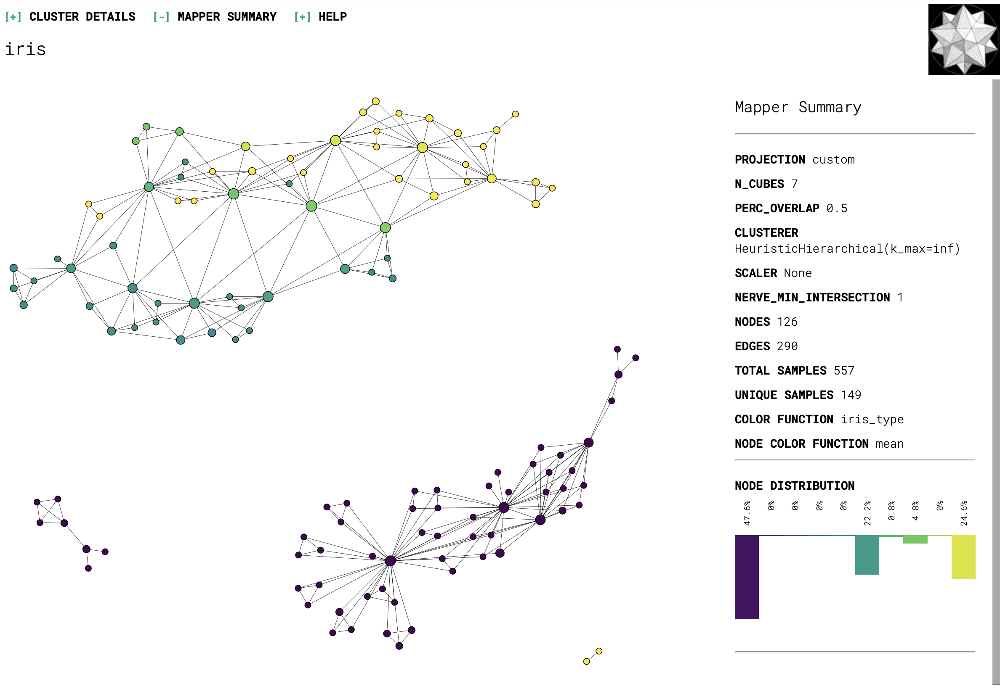

# Mapper-Introduction
Please install [Kepler Mapper](https://kepler-mapper.scikit-tda.org/en/latest/).

## TDA Mapper

## About single_cell directory
We can use mapper for single cell RNA-seq data analysis. Please download file from [Gene Expression Omnibus](https://www.ncbi.nlm.nih.gov/geo/).

## Another Example (Classification)
### Iris Dataset

### Reference
[1] E. Amézquita, M. Quigley, T. A. Ophelders, E. Munch, and D. Chitwood. The shape of things to come: Topological Data Analysis and biology, from molecules to organisms. Developmental dynamics, 249(7):816–833, 2020.  
[2] G. Singh, F. Mémoli, and G. Carlsson. Topological Methods for the Analysis of High Dimensional Data Sets and 3D Object Recognition. The Eurographics Association, 2007.
