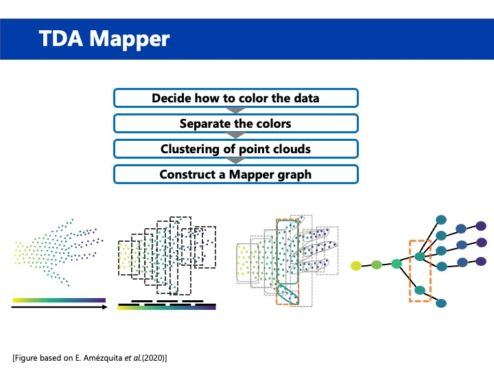

# Mapper-Introduction
Please install [Kepler Mapper](https://kepler-mapper.scikit-tda.org/en/latest/).

## About single_cell
We can use mapper for single cell RNA-seq data analysis. Please download file from [Gene Expression Omnibus](https://www.ncbi.nlm.nih.gov/geo/).

